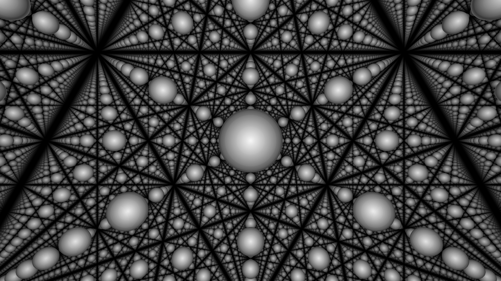

# Raymarching in C



## Compiling:
in fish:
```fish
# load requirements
nix-shell --run fish
# run gcc with flags
gcc (pkg-config --cflags --libs gtk+-3.0 | string split " ") -lm -Wall -Wextra -o march.out main.c
```