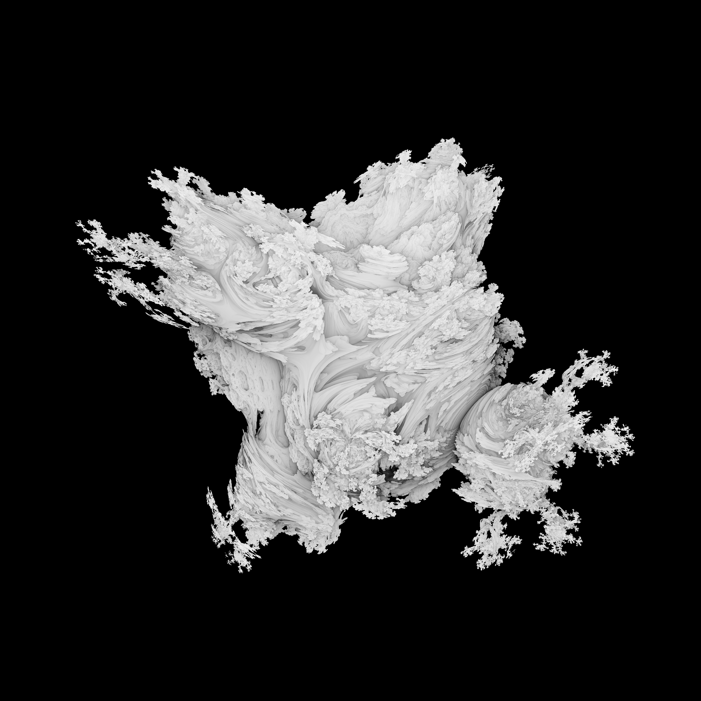

# Raymarching in C

Visit the website at [renders.datenvorr.at](https://renders.datenvorr.at)



## Compiling:

```bash
# load dev environment (for nixos. this loads just gcc and gdb)
nix-shell
# run gcc with flags
gcc -lm -Wall -Wextra -o march.out main.c
```

## Running

give it the number of threads you want to use
```bash
./march.out <power> <file name>
```

## Animating the power

Make sure you compiled a version of the program wich takes the power as first arg and target file name as second arg. I would suggest you hardcode the number of threads to use and set up a suitable camera location manually.

Then edit the parameters in the animate script (it's a fish script, just beware of that) and run it. Depending on your parameters this might take a loooong time to complete. The animate script will not show output of each individual render, but instread display a little progress meter showing the percent of frames complete, the starting power, current power, and the power we want to reach.